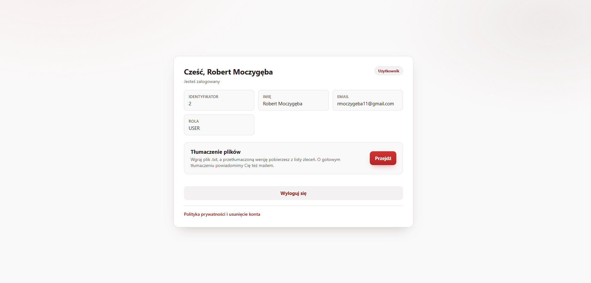

# File Translator — frontend

[](https://react.dev/)
[](https://vite.dev/)
[](https://reactrouter.com/)

Interfejs użytkownika do usługi tłumaczenia plików: rejestracja z potwierdzeniem adresu,
logowanie hasłem albo kontem Google, wysyłanie plików do tłumaczenia, pobieranie wyników
i panel administracyjny.

Backend (Spring Boot 4 / Java 21) jest osobnym repozytorium:
**[File-translator](https://github.com/Robert-m18/File-translator)**.

---

## Demo

**https://file-translator-frontend-react.rmoczygeba11.workers.dev**

Konto testowe, żeby nie zakładać własnego:

| | |
|---|---|
| Login | `rmoczygeba11+demo@gmail.com` |
| Hasło | `DemoFileTranslator1` |

> **Pierwsze wejście może potrwać do ~3 minut.** Sam front odpowiada natychmiast (Cloudflare),
> ale backend stoi na darmowej instancji Rendera, która usypia po okresie bezczynności i budzi
> się dopiero przy pierwszym żądaniu. Objawem jest komunikat o błędzie serwera przy logowaniu —
> wystarczy odczekać i spróbować ponownie. Kolejne żądania są już natychmiastowe.

---

## Zrzuty ekranu

| Logowanie | Pulpit |
|---|---|
|  |  |
| Logowanie hasłem albo kontem Google, z odnośnikiem do polityki prywatności. | Dane sesji pobrane z `GET /auth/me` — jedynego źródła prawdy o zalogowaniu. |

| Tłumaczenie plików | Polityka prywatności |
|---|---|
|  |  |
| Upload, wybór języka docelowego i lista własnych zleceń z ich statusem. | Publiczna strona `/privacy` z terminami retencji i listą podprzetwarzających. |

---

## Stack

| Warstwa | Technologia |
|---|---|
| Framework | React 19 (z React Compiler) |
| Bundler | Vite 8 |
| Routing | React Router 7 |
| Formularze | React Hook Form (ekran rejestracji) |
| Style | zwykły CSS z własnymi właściwościami — bez frameworka |
| Warstwa HTTP | `fetch` opakowany w `src/api/client.js` |
| Hosting | Cloudflare Workers (statyczne assety + fallback SPA) |

Świadomie bez biblioteki komponentów i bez menedżera stanu: aplikacja ma siedem ekranów,
a jedynym stanem globalnym jest sesja użytkownika, którą obsługuje jeden kontekst React.

---

## Szybki start

### Tryb deweloperski

```bash
npm install
npm run dev            # http://localhost:5173
```

Wymaga działającego backendu pod `http://localhost:2009` — najprościej `docker compose up -d`
w repozytorium backendu.

### Całe środowisko w Dockerze

```bash
docker compose up -d --build
```

Wstaje komplet: frontend, backend, PostgreSQL, Redis, MinIO i lokalny serwer pocztowy. Backend
nie jest tu zduplikowany — `docker-compose.yml` wciąga przez `include` plik z repozytorium
backendu, więc każda część opisana jest u siebie.

| Usługa | Adres |
|---|---|
| Frontend | http://localhost:5173 |
| API | http://localhost:2009 |
| Skrzynka pocztowa | http://localhost:8025 |
| PostgreSQL | `localhost:5433` |

Zatrzymanie: `docker compose down` (dane bazy przeżywają w wolumenie, `down -v` kasuje je razem
z nim).

Gdy backend leży w innym katalogu niż domyślny `../Downloads/file_translator`, wskaż go zmienną
`BACKEND_PATH` w pliku `.env` obok `docker-compose.yml`:

```
BACKEND_PATH=../../projekty/file_translator
```

---

## Zmienne środowiskowe

| Zmienna | Domyślnie | Do czego |
|---|---|---|
| `VITE_API_BASE` | `http://localhost:2009` | Adres API. Wkompilowywany w bundle podczas budowania, **nie** czytany w czasie działania |

Konsekwencja jest praktyczna: zmiana adresu API wymaga **przebudowania** aplikacji, a nie
restartu. W Dockerze podaje się go jako argument budowania:

```bash
docker compose build --build-arg VITE_API_BASE=https://moje-api.example.com
```

Na Cloudflare Workers zmienną ustawia się w konfiguracji builda w panelu.

---

## Skrypty

| Polecenie | Co robi |
|---|---|
| `npm run dev` | Serwer deweloperski z HMR na porcie 5173 |
| `npm run build` | Produkcyjny bundle do `dist/` |
| `npm run preview` | Podgląd zbudowanej wersji lokalnie |
| `npm run lint` | ESLint |

---

## Struktura

```
src/
├── api/            warstwa HTTP - jedyne miejsce, które rozmawia z API
│   ├── client.js       ciasteczka, token CSRF, ciche odnawianie sesji, format błędów
│   ├── auth.js         rejestracja, logowanie, sesja, reset hasła
│   ├── translations.js zlecenia tłumaczenia i pobieranie wyników
│   └── admin.js        panel administracyjny
├── auth/           sesja i dostęp do tras
│   ├── AuthContext.jsx stan sesji dla całej aplikacji
│   ├── routes.jsx      strażnicy tras (zalogowany / anonimowy / administrator)
│   └── google.js       adres logowania przez Google i tłumaczenie kodów odmowy
├── components/     Alert, Spinner, przycisk Google
├── pages/          ekrany (patrz tabela tras niżej)
├── utils/          walidacja formularzy, lustrzana wobec reguł serwera
└── index.css       motyw - jeden plik, bez CSS-in-JS
```

### Trasy

| Ścieżka | Dostęp | Ekran |
|---|---|---|
| `/` | anonimowy | Logowanie |
| `/register` | anonimowy | Rejestracja |
| `/confirm-email` | publiczny | Potwierdzenie adresu z linku w mailu |
| `/forgot-password` | publiczny | Prośba o reset hasła |
| `/reset-password` | publiczny | Ustawienie nowego hasła z linku w mailu |
| `/privacy` | publiczny | Polityka prywatności |
| `/dashboard` | zalogowany | Pulpit |
| `/translations` | zalogowany | Wysyłanie plików i lista zleceń |
| `/admin/users` | administrator | Panel kont |

**Trzy z tych adresów są sklejane po stronie serwera** i trafiają do treści maili:
`/confirm-email`, `/reset-password` i `/forgot-password`. Zmiana którejkolwiek ścieżki
unieruchamia linki w wiadomościach, które już poszły do skrzynek — trzeba je zmieniać razem
z konfiguracją backendu.

Logowanie stoi pod adresem głównym, a trasa `/login` **nie istnieje**. Backend wskazuje adres
główny jako miejsce powrotu po nieudanym logowaniu Google (`app.oauth2.failure-path`), więc ta
zależność jest obustronna.

---

## Kontrakt z backendem

Cztery rzeczy, na których taki interfejs wywraca się najpierw, i to z mylącymi objawami:

1. **Każde wywołanie dołącza ciasteczka** (`credentials: 'include'`). Tożsamość niesie ciasteczko
   `httpOnly`, a nie nagłówek autoryzacji. Bez tej flagi przeglądarka nie wyśle go na inny origin
   i wszystko wraca jako brak uwierzytelnienia — objaw wygląda jak wygasła sesja, choć ciasteczko
   nigdy nie opuściło przeglądarki.

2. **Token CSRF pobierany jest z ciała odpowiedzi `GET /auth/csrf`** i odsyłany w nagłówku.
   Ciasteczko z tokenem jest niedostępne dla skryptów, więc przeglądarka dosyła je sama, a serwer
   porównuje jedno z drugim. Token żyje w pamięci modułu — przetrwanie odświeżenia strony niczego
   by nie dało, bo i tak pobierany jest nowy.

3. **Adres frontu musi zgadzać się z `app.frontend.url` po stronie backendu.** Przy ciasteczkach
   sesji polityka CORS nie dopuszcza gwiazdki, więc pod innym adresem przeglądarka odrzuci każde
   żądanie. Lokalnie oznacza to port **5173**, a nie dowolny wolny.

4. **`GET /auth/me` jest jedynym źródłem prawdy o sesji** — przy starcie aplikacji i po każdym
   odświeżeniu strony. Flaga w pamięci przeglądarki kłamałaby w obie strony: zostawałaby po
   wygaśnięciu sesji i znikałaby mimo ważnej sesji na serwerze.

Błędy przychodzą w formacie RFC 9457. Rozgałęziać się należy po **kodzie maszynowym**, a nie po
tekście komunikatu, bo tekst jest przeznaczony dla człowieka i może się zmienić.

---

## Budowanie i wdrożenie

Produkcja stoi na **Cloudflare Workers** (nie Pages), a konfigurację niesie `wrangler.jsonc`:

```jsonc
{
  "name": "file-translator-frontend-react",
  "assets": {
    "directory": "./dist",
    "not_found_handling": "single-page-application"
  }
}
```

Kluczowe jest `not_found_handling` — bez niego wejście wprost na `/confirm-email` z linku
w mailu kończy się odpowiedzią „nie znaleziono", bo Workers szukają pliku o takiej nazwie
zamiast oddać `index.html` do obsłużenia przez router.

Build w Cloudflare wykonuje `npm ci`, więc `package-lock.json` musi zgadzać się z `package.json`.

---

## Znane usterki

- `npm run lint` zgłasza **dwa** błędy `react-hooks/set-state-in-effect` — w `Translations.jsx`
  i `AdminUsers.jsx`. Oba pochodzą z tego samego wzorca odświeżania listy w efekcie. Do naprawy
  razem, bo jeden ekran zgodny z regułą, a drugi nie, byłby stanem gorszym niż obecny.

---

## Konwencje

- Komentarze po polsku — to język roboczy autora.
- Komentarz mówi **co kod robi, dlaczego tak i co to daje**; nie jest dziennikiem zmian.
- Style trzymają jedną regułę: **szarość niesie powierzchnie, czerwień wyłącznie działania**.
  Czerwone tło zarezerwowane jest dla komunikatów o błędzie — dzięki temu błąd rzuca się w oczy.
